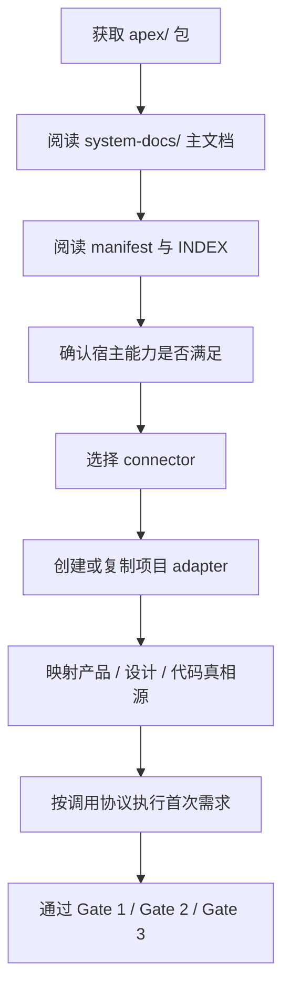

# APEX 部署与接入文档

## 文档登记

- 文档名称：APEX 部署与接入文档
- 当前版本：4.15.0
- 文档类型：系统级部署与接入主文档
- 适用对象：平台维护者、迁移执行人、项目接入人

## 文档目的

本文件说明 APEX 如何作为一套通用系统包被打包、迁移、安装、接入新项目，并在不影响核心工作流与核心逻辑的前提下完成首次落地。

说明：

- 本文档把“部署”和“接入”视为同一类系统文档
- 当前不单列接口文档

## 3.0.2 接入要求

APEX 接入不止复制 Core 与选择 connector。首次真实任务必须按项目事实选择 Greenfield 或 Existing 轨道：前者建立 Product / Architecture / Site Contract，后者完成真实 Baseline / Functional Freeze / Impact。两条轨道在 Gate 1 效果图与参数合同、Stitch 可编辑画布和暂存 Freeze 阶段汇合；自动严格编排完成 Stitch Seal、Visual Bundle、Implementation Map 与依赖锁，并通过机器 Gate 2 才能实施。运行时必须自动采集 DOM 与截图完成第二段严格 Gate，最终以 Verification Bundle 和 Gate 3 完成真实验收。

## 一、最小交付包

APEX 最小通用包应包含：

- `README.md`
- `INDEX.md`
- `PACKAGING.md`
- `manifest.yaml`
- `core/`
- `references/`
- `skills/`
- `connectors/`
- `system-docs/`

可选附带：

- `adapters/examples/`

具体业务项目的 Adapter 与参考实现默认不进入公开包，只能随已授权的项目私有迁移。

## 二、安装与迁移总流程



## 三、宿主环境要求

最小要求：

- 可读取项目代码
- 可编辑项目文件
- 可访问项目文档
- 可执行结构化步骤输出

推荐要求：

- 可重启目标服务
- 可访问真实页面
- 可做截图或浏览器自动化
- 可运行最小验证命令

## 四、接入新项目步骤

### 1. 复制 APEX

从 GitHub 获取当前发布包：

```bash
mkdir -p "$HOME/.codex/apex"
git clone https://github.com/bigywave-gif/APEX.git "$HOME/.codex/apex/APEX"
```

安装后的 APEX Core 唯一主目录为 `$HOME/.codex/apex/APEX`。不得把业务项目内副本、其他工作区副本
或临时目录作为规则真相源或升级目标。业务项目只保留自己的 `<project-root>/.apex/` 运行产物。

当前脚本发行版以 `/Users/fredyw/.codex/apex/APEX` 为默认规范化路径；在其他账号或平台部署时，
应在安装阶段统一替换为实际的 `$HOME/.codex/apex/APEX` 绝对路径，并运行发布审计，不得让同一安装混用多个 Core 根目录。

### 2. 阅读主入口

优先阅读：

1. `apex/system-docs/README.md`
2. `apex/system-docs/product-document.md`
3. `apex/system-docs/technical-architecture.md`
4. `apex/system-docs/deployment-and-integration.md`

### 3. 阅读核心协议

至少阅读：

- `core/runtime/invocation-spec.md`
- `core/policies/admission-rules.md`
- `core/policies/priority-model.md`
- `core/runtime/host-capability-governance.md`

如需理解当前增强层能力面，还应阅读：

- `references/adopted/adopted-design-rules.md`
- `references/external/source-review-records.md`
- `core/runtime/tooling-matrix.md`

### 4. 选择 connector

根据项目类型选择：

- `generic-web-app`
- `react-saas`
- `vue-admin`
- `vanilla-js-app`

### 5. 创建 adapter

新建项目自己的 adapter，并映射：

- 产品真相源
- 设计真相源
- 代码入口
- 页面家族
- 验收映射

### 6. 跑首轮真实需求

必须至少用一条真实需求走完：

- APEX 准入
- Gate 1
- Gate 2
- 实现
- Gate 3

### 7. 配置 Codex 全局接入

通过唯一主目录中的 `runtime/host-bridges/codex-skill/SKILL.md` 发布全局 `apex` Skill。每次
Router 调用会自动同步该 Bridge，因此 APEX Core、Schema、规范或 Skill 更新后，新 session
和既有 session 的下一次 APEX 调用都会加载最新规则；若发布失败，Router 必须阻断执行。

## 五、connector 选择原则

### `generic-web-app`

适合：

- 技术栈混合
- 页面形态较多
- 暂不想强绑定框架

### `react-saas`

适合：

- React 组件化产品
- 设计系统边界清晰

### `vue-admin`

适合：

- Vue 后台类项目
- 强表单、强配置、强管理能力

### `vanilla-js-app`

适合：

- 单入口
- 原生 DOM 驱动
- 非组件框架项目

## 六、adapter 设计要求

adapter 只能做项目映射，不应复制 Core。

必须包含：

- 产品真相源
- 设计真相源
- 代码入口
- 页面家族
- 验收方式

不应包含：

- 第二份状态机
- 第二份 Gate 规则
- 第二份核心优先级策略

## 七、部署与接入边界

### 可以调整的内容

- connector 选择
- adapter 内容
- 技能层接入
- 外部 adopted 规则
- 增强层更新提示
- 开源增强层底座的纳入与降级

### 不应被接入时改变的内容

- APEX 核心状态机
- Gate 语义
- 主调用协议
- 恢复协议
- 核心优先级模型

## 八、当前增强层底座

当前 APEX 已明确纳入的高优先级增强层底座包括：

- `google-design-md`
- `shadcn-ui`
- `radix-primitives`
- `lucide`
- `motion`
- `storybook`
- `axe-core`

接入时原则：

- 这些底座是候选可执行来源，而不是只供参考的样式图库；选中后必须记录资源 ID、版本、文件/API、许可和落地方式。
- 它们不应迫使宿主项目统一改写为某个框架
- 不适配的宿主项目只能选择现有项目代码或 native-web 等其他真实来源；不得以“等价说明”替代实际加载、物化和运行时验收。

## 九、发布前检查

发布或迁移前至少完成：

1. 检查 `manifest.yaml` 入口是否有效
2. 检查 `system-docs/` 是否完整
3. 检查 `references/external` 与 `references/adopted` 是否一致
4. 检查 `registry/skills/manifest.yaml` 与激活矩阵是否一致
5. 检查 connectors 与 examples 是否仍可用
6. 运行 `node scripts/release-audit.mjs`，确认 manifest YAML、入口路径、Router 合约、全局 Skill、动作守卫与文档调用路径均通过

## 十、首次落地验收

完成接入后，至少要确认：

1. 准入是否准确命中
2. 模式判断是否正确
3. Gate 是否按顺序出现
4. 核心工作流是否未被破坏
5. 增强层是否仍能按提示方式更新

## 交叉引用

- [README.md](https://github.com/bigywave-gif/APEX/blob/main/README.md)
- [product-document.md](https://github.com/bigywave-gif/APEX/blob/main/system-docs/product-document.md)
- [technical-architecture.md](https://github.com/bigywave-gif/APEX/blob/main/system-docs/technical-architecture.md)
- [../PACKAGING.md](https://github.com/bigywave-gif/APEX/blob/main/PACKAGING.md)
- [../connectors/connector-selection.md](https://github.com/bigywave-gif/APEX/blob/main/connectors/connector-selection.md)
- [../adapters/README.md](https://github.com/bigywave-gif/APEX/blob/main/adapters/README.md)
