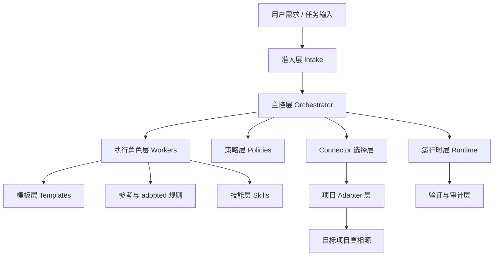
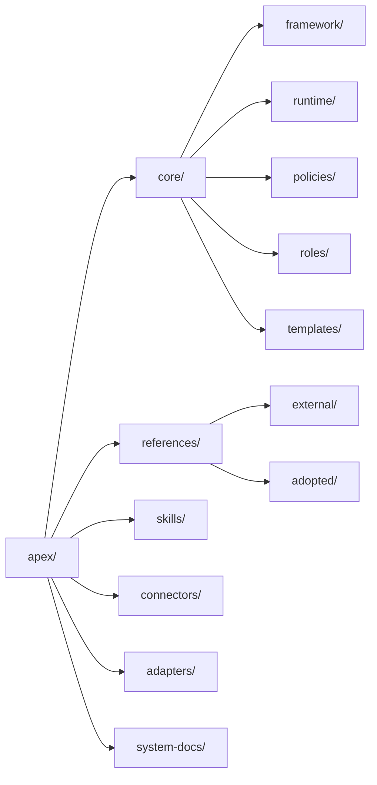
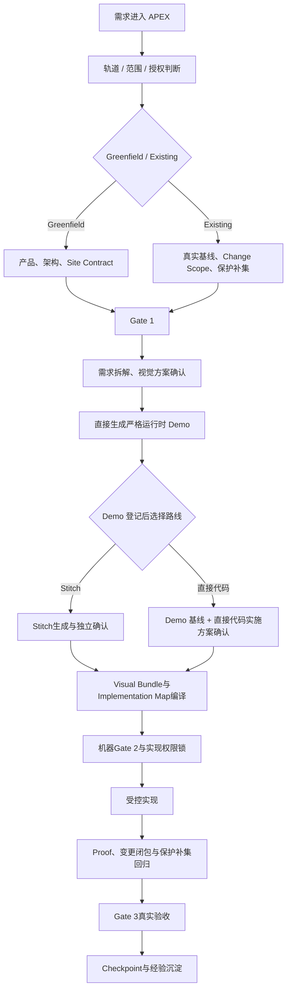
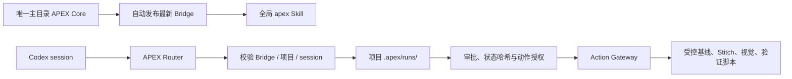
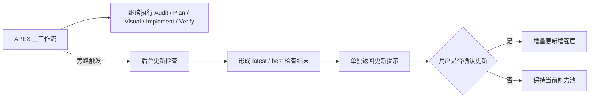
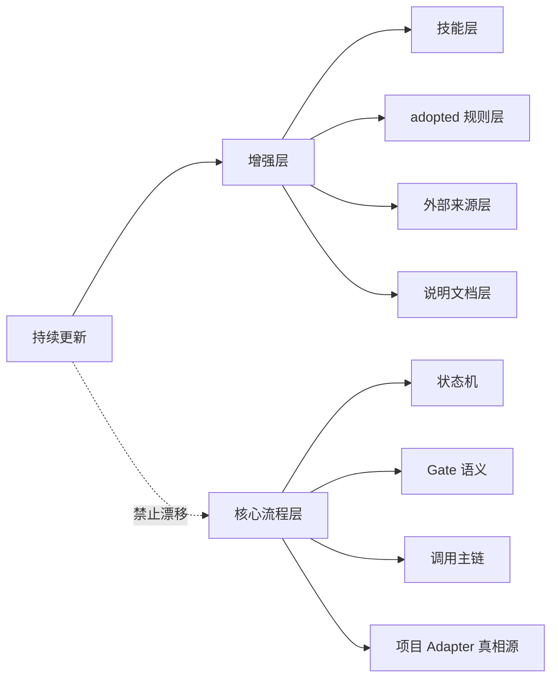

# APEX 技术架构文档

## 文档登记

- 文档名称：APEX 技术架构文档
- 当前版本：4.16.1
- 文档类型：系统级技术架构主文档
- 适用对象：架构、研发、平台治理、交付负责人

## 文档目的

本文件说明 APEX 本体的技术结构、模块职责、运行链路、状态机与 Gate 的关系、宿主依赖边界、增强层更新边界，以及迁移到新项目时必须理解的关键细节。

本文件不是某个项目的业务架构图，而是 APEX 作为通用交付系统的架构图。

## 3.0 架构范围

本架构在双轨状态机基础上引入 Router-first Codex 调用、项目级 Run/session 隔离、结构化审批与状态哈希授权、项目 mutation lease、需求拆解与视觉描述、视觉实施方案确认后直接生成并登记效果图、效果图登记后选择 Stitch 或直接代码、Stitch 的独立确认及其暂存 Freeze 与 Seal、自动结构合同导出、结构化 Visual Bundle 编译、实现权限锁、Checkpoint 增量恢复与 Gate 3 真实验收。以下架构图与运行链路均以这些约束为准。

## 一、系统分层架构图

## 二、目录架构图

## 三、APEX 当前执行流程图（以 manifest.version 为准）

### Existing 局部变更边界

`change-scope.json` 将用户要求转换为受影响路由、页面、视觉节点、数据视图和代码目标，并把代码参考闭包的其余文件冻结为保护补集。Gate 1 与视觉方案只展示闭包内的增量决策；Gate 2 验证视觉节点、来源和 Implementation Map 没有越界；Gate 3 复核保护文件 SHA-256 与同文件未调整节点的运行时回归。范围扩大必须重新生成并确认该合同，不能由执行器隐式推断。

## 三点二、Router-first 调用与自动 Skill 同步

Router 是项目 run、session、阶段、审批和动作授权的唯一代码化入口。每次调用先把
`~/.codex/apex/APEX` 中的 Bridge 自动发布至全局 `apex` Skill，再校验哈希。
新 session 必须新建 run；同一 session 只能恢复自己的 run；项目级 mutation lease 防止不同
run 同时修改同一项目。所有项目中间产物保存在 `<project-root>/.apex/`，不进入 APEX Core。

## 三点五、后台更新旁路图

说明：

- 后台更新检查不是主链 Gate 条件
- 更新检查只是一条旁路增强分支
- 当前主任务不应因为外部扫描较慢而卡住

## 四、模块职责

### 1. Core

`core/` 是 APEX 的稳定主骨架。

包含：

- `framework/`：定义系统主流程、状态机、Gate
- `runtime/`：定义调用、恢复、审计、工具矩阵、安装迁移、打包发布
- `policies/`：定义准入、优先级、阈值、失败分支、可访问性等政策
- `roles/`：定义不同执行角色的职责
- `templates/`：定义标准化输出模板

### 2. References

`references/` 处理外部来源与采用规则：

- `external/`：维护来源、许可证、采用边界、持续更新策略
- `adopted/`：维护经过 APEX 采用后的本地规则

当前已纳入的关键增强层来源包括：

- `google-design-md`
- `shadcn-ui`
- `radix-primitives`
- `lucide`
- `motion`
- `storybook`
- `axe-core`

### 3. Skills

`skills/` 管理能力层，而不是核心流程层。

职责：

- 维护技能清单
- 定义激活矩阵
- 定义冲突优先级
- 描述每个技能的职责边界

说明：

- 技能层负责执行强化
- 开源增强层底座负责提供更稳定的规范参考
- 二者是互补关系，不是替代关系

### 4. Connectors

`connectors/` 是项目类型模板层。

职责：

- 指导不同类型项目如何接入
- 避免把通用 APEX 核心直接硬贴到任何项目

### 5. Adapters

`adapters/` 是项目接入层。

职责：

- 映射产品真相源
- 映射设计真相源
- 映射代码入口
- 映射页面家族
- 映射验收链路

### 6. System Docs

`system-docs/` 是系统级可连续阅读入口层。

职责：

- 提供产品主文档
- 提供架构主文档
- 提供部署与接入主文档

说明：

- 它不改变 `core/` 的真相源地位
- 只降低阅读和治理成本

## 五、关键运行链路细节

### 1. 准入链路

由以下载体定义：

- `core/runtime/invocation-spec.md`
- `core/policies/admission-rules.md`
- `core/policies/priority-model.md`

职责：

- 判断是否命中 APEX
- 判断走 `Lite / Standard / Full`
- 判断当前应该进入哪个阶段

### 2. 执行链路

执行链路中的设计能力分工如下：

- `google-design-md`：作为默认设计契约层，作用于Site Contract、Visual、Implement和Verify阶段
- `product design` 插件：作为可选宿主增强层，挂在 `Audit / Visual / Implement(image-to-code)` 子链路
- `APEX Core`：继续独占准入、分级、Gate、恢复协议与真实验收语义

这意味着：

- 设计插件负责“增强执行能力”
- adopted design rules 负责“稳定设计约束”
- APEX Core 负责“流程裁决与交付闭环”

由以下载体定义：

- `core/framework/APEX.md`
- `core/framework/state-machine.md`
- `core/framework/gates.md`
- `core/roles/*.md`

职责：

- 规定步骤顺序
- 规定角色分工
- 规定 Gate 语义

执行脚本不直接暴露为流程入口。Router 先按当前 Gate 返回 `allowedActions`，随后签发绑定
项目、run、session、动作和 `state.json` 哈希的短时授权；`apex-action.mjs` 只允许已登记脚本
执行。状态变化会立即使旧授权失效，防止由过期上下文、并发 session 或文档命令造成跳流程。

### 3. 验证链路

由以下载体定义：

- `core/runtime/apex-audit-spec.md`
- `core/templates/verify-template.md`
- `core/policies/accessibility-gate.md`
- `core/runtime/tooling-matrix.md`
- `core/runtime/plugin-capability-inventory.md`

职责：

- 规定要验证什么
- 规定验证结果如何表达
- 规定质量门和无障碍门
- 规定哪些增强层工具能力可参与验证

### 4. 更新检查旁路

由以下载体定义：

- `references/external/continuous-update-policy.md`
- `core/runtime/invocation-spec.md`

职责：

- 规定更新检查如何后台执行
- 规定更新提示何时返回
- 规定如何避免阻塞主工作流

## 六、宿主关系

APEX 本身不是项目运行时。

它运行时必须依附宿主环境提供：

- 文件系统读写能力
- 基础命令执行能力
- 浏览器或页面验证能力
- 具体项目代码真相源

宿主能力边界由：

- `core/runtime/host-capability-governance.md`
- `core/runtime/system-requirements.md`

定义。

## 七、更新边界图

## 七点五、更新执行边界

- 更新检查可以自动触发，但应后台执行
- 更新纳入必须等待用户确认
- 更新检查和主任务执行不是同一条同步阻塞链路
- 即便外部检索很慢，主工作流也必须继续

## 八、关键架构原则

### 单一真相源

- `core/` 是 APEX 核心真相源
- `system-docs/` 是阅读入口层，不覆盖真相源

### 主流程稳定

- 核心状态机不能在任务中顺手漂移
- Gate 语义不能被增强层更新篡改

### 增强层可演进

- 技能
- 外部规范
- adopted 规则
- 文档说明层

可以在确认后持续增强。

### 增强层分层清晰

- `shadcn-ui / radix-primitives`：组件与交互原语层
- `lucide`：图标系统层
- `motion`：工程动效层
- `storybook`：组件文档与状态展示层
- `axe-core`：无障碍自动检测层
- `impeccable / taste-skill / ui-ux-pro-max-skill`：执行与视觉强化层

### 项目接入层必须薄

Adapter 不能把整套 Core 复制一遍，否则后续会失去统一升级能力。

## 九、当前落地标准

技术架构文档必须满足：

1. 有整体架构图
2. 有执行流程图
3. 有更新边界图
4. 有后台更新旁路图
5. 有模块职责
6. 有宿主关系
7. 有关键细节说明

## 交叉引用

- [README.md](../README.md)
- [product-document.md](product-document.md)
- [deployment-and-integration.md](deployment-and-integration.md)
- [../core/framework/APEX.md](../core/framework/APEX.md)
- [../core/framework/state-machine.md](../core/framework/state-machine.md)
- [../core/framework/gates.md](../core/framework/gates.md)
